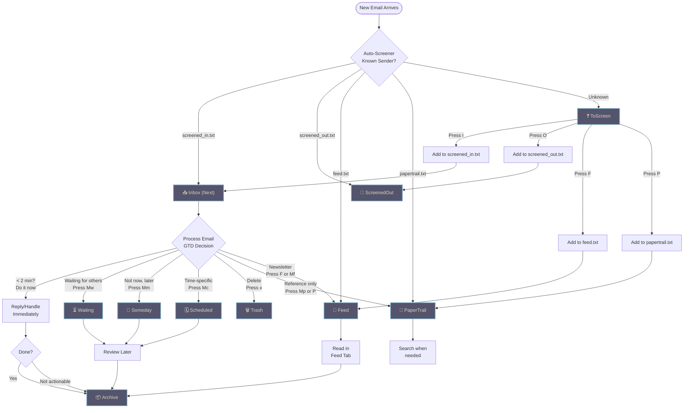

A minimal terminal email client for people who write in Markdown and live in Neovim.

*Neomd is my way of implementing an email TUI based on my experience with Neomutt, focusing on [Neovim](https://www.ssp.sh/brain/neovim) (input) and reading/writing in [Markdown](https://www.ssp.sh/brain/markdown) and navigating with [Vim Motions](https://www.ssp.sh/brain/vim-language-and-motions) with the GTD workflow and [HEY-Screener](https://www.hey.com/features/the-screener/).*

## The philosophy behind Neomd: What's unique?

The key here is **speed** in which you can **navigate, read, and process** your email. Everything is just a shortcut away, and instantly (ms not seconds). It's similar to the foundations that Superhuman was built on: it runs on Gmail and makes it fast with vim commands.

With the **HEY-Screener**, you get only emails in your inbox that you _screened in_, no spam or sales pitch before you added them. Or don't like them, just screen them out, and they get automatically moved to the "ScreenedOut" folder.

With the [GTD approach](https://www.ssp.sh/brain/getting-things-done-gtd), using folders such as next (inbox), waiting, someday, scheduled, or archive, you can move them with one shortcut. This allows you quickly to move emails you need to wait for, or deal with later, in the right category. **Processing your email only once**.

Also, we intentionally don't add more folders to the archive or file emails too, only archive (and work if you use business/personal - but that's not even needed). The goal is to let emails fade out, avoid the "busy work," and file them. We use search when we need it, or copy important information into Obsidian or our daily work. That's why we only have limited folders (and also why we currently can't add additional ones; see [FAQ](https://neomd.ssp.sh/docs/faq/#is-it-possible-to-create-new-directoriestabs).

But we have two additional **Feed** and **Papertrail**, two dedicated folders from HEY where you can read newsletters (just hit F) on them automatically in their separate tab, or move all your receipts into the Papertrail. Once you mark them as feed or papertrail, they will moved there automatically going forward. So you decide whether to read emails or news by jumping to different tabs.


### Email Processing Workflow

Here's how neomd combines HEY-Screener + GTD + Feed/Papertrail to process your email:


*all colored boxes represent neomd folders*

**Key principles:**
- **Screener first**: Unknown senders never clutter your Inbox, but get automatically wait in ToScreen for classification [more](https://neomd.ssp.sh/docs/screener/)
- **One-time decision**: Once you classify a sender (`I/O/F/P`), all future emails from them are automatically routed [more](https://neomd.ssp.sh/docs/screener/#how-classification-works)
- **GTD processing**: Emails in Inbox are processed once. Inbox acting as want/need to do *Next*, otherwise move to Waiting, Someday, or Scheduled 
- **Minimal filing**: Only Archive when done; no complex folder hierarchies. Use search to find old emails 
- **Separate contexts**: Feed for newsletters (read when you want), PaperTrail for receipts (search when needed) 
- See full features list below.


## Screenshots

### Overview: List-View

Feed view with all Newsletters - also workflow with differnt tabs and unread counter only for certain tabs (not all):

*Features seen: Reading newsletter directly in your email client (feed) - see spy pixel, if you have replied (dot) and thread mode if replied*

### Reading Panel

Reading an email with Markdown 💙:


### Sent emails
This is the markdown sent:

```markdown
# [neomd: to: email@domain.com]
# [neomd: subject: this is an email from neomd!]

This email is from Neomd. Great I can add links such as [this](https://ssp.sh) with plain Markdown.

E.g. **bold** or _italic_.

## Does headers work too?

this is a text before a h3.

### H3 header

how does that look in an email?
Best regards
```

*Compose emails in your editor, read them rendered with [glamour](https://github.com/charmbracelet/glamour), and manage your inbox with a [HEY-style screener](https://www.hey.com/features/the-screener/) — all from the terminal.*


Which looks like this:


Or in Gmail:


### Video

  YouTube rundown of most features:
  [](https://youtu.be/8aKkldYLWV8)
*(shorter but limited showcase [part 1 video](https://youtu.be/lpmHqIrCC-w))*

## Features

### What Makes It Different

These features are the one that makes neomd different to other email clients out there.

- **Write in Markdown, send beautifully** — compose in `$EDITOR` (defaults to `nvim`), send as `multipart/alternative`: raw Markdown as plain text + goldmark-rendered HTML so recipients get clickable links, bold, headers, inline code, and code blocks [→](https://neomd.ssp.sh/docs/sending/)
- **HEY-style screener** — unknown senders land in `ToScreen`; press `I/O/F/P` to approve, block, mark as Feed, or mark as PaperTrail; reuses your existing `screened_in.txt` lists from neomutt; also acts as a **phishing defense** — impersonation emails from senders you've already approved land in ToScreen instead of Inbox, making them immediately suspicious [→](https://neomd.ssp.sh/docs/screener/)
- **Glamour reading** — incoming emails rendered as styled Markdown in the terminal [→](https://neomd.ssp.sh/docs/reading/)
- **Spy pixel blocking** — tracking pixels from newsletter services (Mailchimp, SendGrid, HubSpot, etc.) are automatically detected, counted, and stripped; `°` indicator in the inbox and tracker domains in the reader header; browser view (`O`) blocks remote images via CSP — senders cannot tell if you read their email [→](https://neomd.ssp.sh/docs/reading/#spy-pixel-blocking)
- **GitHub/Obsidian-style callouts** — compose emails with callout syntax `> [!note]`, `> [!tip]`, `> [!warning]` for styled alert boxes in HTML emails; rendered with colored left borders, subtle backgrounds, and emoji icons [→](https://neomd.ssp.sh/docs/sending/#callouts-admonition)
- **Listmonk newsletter integration** — compose an email to a virtual address (e.g. `listmonk@ssp.sh`) and neomd creates a scheduled campaign in [Listmonk](https://listmonk.app) via API instead of sending via SMTP; configure multiple trigger addresses to target different subscriber lists; pre-send screen shows campaign details [→](https://neomd.ssp.sh/docs/integrations/listmonk/)


### Inbox & Screener

Keep your inbox clean without effort.

- **Auto-screen on load** — screener runs automatically every time the Inbox loads (startup, `R`); keeps your inbox clean without pressing `S` (configurable, on by default) [→](https://neomd.ssp.sh/docs/screener/#auto-screen-and-background-sync)
- **Whole-domain screening** — list entries beginning with `@` (e.g. `@ssp.sh`) match every address at that domain; per-address entries always win over a domain rule so a single blocked address inside an otherwise-approved domain stays blocked; press `Di` / `Do` to append `@<domain>` to your lists with a `y/n` confirm [→](https://neomd.ssp.sh/docs/screener/#domain-entries)
- **Background sync** — while neomd is open, inbox is fetched and screened every 5 minutes in the background; interval configurable, set to `0` to disable [→](https://neomd.ssp.sh/docs/screener/#auto-screen-and-background-sync)
- **Headless daemon mode** — run `neomd --headless` on a server to continuously screen emails without the TUI; watches screener list files for changes via Syncthing; perfect for running on a NAS while using the TUI on laptop/Android [→](https://neomd.ssp.sh/docs/configurations/headless/)
- **Desktop notifications for VIP senders** — opt-in `[notifications]` block fires `notify-send` only for senders/domains you list in `notify.txt`; independent of screener categories; first run silently records a baseline so you don't get flooded [→](https://neomd.ssp.sh/docs/notifications/)
- **Folder tabs** — Inbox, ToScreen, Feed, PaperTrail, Archive, Waiting, Someday, Scheduled, Sent, Trash, ScreenedOut [→](https://neomd.ssp.sh/docs/keybindings/#folders)


### Composing & Sending

- **Pre-send review** — after closing the editor, review To/Subject/body before sending; attach files, save to Drafts, or re-open the editor — no accidental sends [→](https://neomd.ssp.sh/docs/sending/#pre-send-review)
- **Attachments** — attach files from the pre-send screen via yazi (`a`); images appear inline in the email body, other files as attachments; also attach from within Neovim via `<leader>a`; the reader lists all attachments and `1`–`9` downloads and opens them [→](https://neomd.ssp.sh/docs/sending/#attachments)
- **Emoji reactions** — press `ctrl+e` from inbox or reader to react with emoji (👍 ❤️ 😂 🎉 🙏 💯 👀 ✅); instant send with proper threading and quoted message history, no editor needed [→](https://neomd.ssp.sh/docs/sending/#emoji-reactions)
- **Multi-select** — `m` marks emails, then batch-delete, move, or screen them all at once [→](https://neomd.ssp.sh/docs/keybindings/#multi-select--undo)
- **Undo** — `u` reverses the last move or delete (`x`, `A`, `M*`) using the UIDPLUS destination UID [→](https://neomd.ssp.sh/docs/keybindings/#multi-select--undo)

### Reading

- **Threaded inbox** — related emails grouped together with a vertical connector line (`│`/`╰`), Twitter-style; threads detected via `In-Reply-To`/`Message-ID` headers with a subject+participant fallback; newest reply on top, root at bottom; `·` reply indicator shows which emails you've answered [→](https://neomd.ssp.sh/docs/reading/#threaded-inbox)
- **Conversation view** — `T` or `:thread` shows the full conversation across folders (Inbox, Sent, Archive, etc.) in a temporary tab with `[Folder]` prefix; see your replies alongside received emails [→](https://neomd.ssp.sh/docs/reading/#conversation-view)
- **Link opener** — links in emails are numbered `[1]`–`[0]` in the reader header; press `space+digit` to open in `$BROWSER` [→](https://neomd.ssp.sh/docs/reading/#links)
- **Everything view** — `ge` or `:everything` shows the 50 most recent emails across all folders; find emails that were screened out, moved to spam, or otherwise hard to locate [→](https://neomd.ssp.sh/docs/keybindings/#folders)

### Search

- **Search** — `/` filters loaded emails in-memory; `space /` or `:search` runs IMAP SEARCH across all folders (fetching headers, capped at 100 per folder) with results in a temporary "Search" tab; supports `from:`, `subject:`, `to:` prefixes [→](https://neomd.ssp.sh/docs/keybindings/#leader-key-mappings-space-prefix)

### Standard Email Features

- **CC, BCC, Reply-all** — optional Cc/Bcc fields (toggle with `ctrl+b`); `R` in the reader replies to sender + all CC recipients [→](https://neomd.ssp.sh/docs/sending/#cc-bcc-reply-all-and-forward)
- **Drafts** — `d` in pre-send saves to Drafts (IMAP APPEND); `E` in the reader re-opens a draft as an editable compose; compose sessions are auto-backed up to `~/.cache/neomd/drafts/` so you never lose an unsent email (`:recover` to reopen) [→](https://neomd.ssp.sh/docs/sending/#drafts)
- **Multiple From addresses** — define SMTP-only `[[senders]]` aliases (e.g. `s@ssp.sh` through an existing account); cycle with `ctrl+f` in compose and pre-send; sent copies always land in the Sent folder [→](https://neomd.ssp.sh/docs/sending/#multiple-from-addresses)
- **HTML signatures** — configure separate text and HTML signatures; text signature appears in editor and plain text part, HTML signature in HTML part only; use `[html-signature]` placeholder to control inclusion per-email [→](https://neomd.ssp.sh/docs/configuration/#html-signatures)
- **Address autocomplete** — To/Cc/Bcc fields autocomplete from screener lists; navigate with `ctrl+n`/`ctrl+p`, accept with `tab`

### Under the Hood

- **IMAP + SMTP** — direct connection via RFC 6851 MOVE, no local sync daemon required; stays in sync if you use it on mobile or different device [→](https://neomd.ssp.sh/docs/configuration/)
- **RFC 5322 compliant email delivery** — Message-IDs use sender's domain, proper MIME multipart/alternative structure (text/plain before text/html), quoted-printable encoding, and all required headers; ensures deliverability across all providers, spam filter compatibility, and correct email threading [→](https://neomd.ssp.sh/docs/configurations/email-standards/)
- **Kanagawa theme** — colors from the [kanagawa.nvim](https://github.com/rebelot/kanagawa.nvim) palette


neomd's **speed** depends entirely on your IMAP provider. On Hostpoint (the provider I use), a folder switch takes **~33ms** which feels instant. On Gmail, the same operation takes **~570ms** which is noticeably slow. See [Benchmark](#benchmark) for full details and how to test your provider.



## Install

**Prerequisites:** [Go 1.22+](https://go.dev/doc/install) and `make`.


neomd moves, deletes, and modifies emails directly on your IMAP server. These operations affect your mailbox across all devices. **Back up important emails before first use.** neomd is experimental software and can't take responsibility for lost or misplaced emails. Consider testing with a secondary email account first.




**Optional attachment helpers:**
- `yazi` enables the built-in file picker used by pre-send `a`
- custom Neovim integration in `custom.lua` enables inline `<leader>a` attachment insertion inside `neomd-*.md` buffers
- without these, neomd still works; the inline Neovim attachment workflow just won't be available



```sh
git clone https://github.com/ssp-data/neomd
cd neomd
make install   # installs to ~/.local/bin/neomd
```

Or just build locally:

```sh
make build
./neomd
```

Or if on Arch Linux (AUR), you can use my [neomd-bin](https://aur.archlinux.org/packages/neomd-bin) via:
```sh
yay -S neomd-bin
```


On first run, neomd:
1. Creates `~/.config/neomd/config.toml` with placeholders — fill in your IMAP/SMTP credentials
    - Important: Make sure that the Capitalization and naming of folder in `config.toml` is accroding to webmail IMAP, e.g. [Gmails](docs/content/docs/configurations/gmail.md) uses `sent = "[Gmail]/Sent Mail"` and not `sent` etc. 
2. Creates `~/.config/neomd/lists/` for screener allowlists (or uses your custom paths from config)
3. Creates any missing IMAP folders (ToScreen, Feed, PaperTrail, etc.) automatically


Neomd also runs on Android (more for fun) — see [docs/content/docs/configurations/android.md](docs/content/configurations/android).

## Configuration

On first run, neomd creates `~/.config/neomd/config.toml` with placeholders:

```toml
[[accounts]]
name     = "Personal"
imap     = "imap.example.com:993"   # :993 = TLS, :143 = STARTTLS
smtp     = "smtp.example.com:587"
user     = "me@example.com"
password = "app-password"
from     = "Me <me@example.com>"
starttls = false
tls_cert_file = ""                  # optional PEM cert/CA for self-signed local bridges

# Root-level settings
store_sent_drafts_in_sending_account = false  # default: Sent/Drafts use first account; true = follow sending account

[screener]
screened_in  = "~/.config/neomd/lists/screened_in.txt"
screened_out = "~/.config/neomd/lists/screened_out.txt"
feed         = "~/.config/neomd/lists/feed.txt"
papertrail   = "~/.config/neomd/lists/papertrail.txt"
spam         = "~/.config/neomd/lists/spam.txt"
```

Use an app-specific password (Gmail, Fastmail, Hostpoint, etc.) rather than your main account password. The `password` and `user` fields support environment variable expansion (`$VAR` or `${VAR}`) so you can avoid storing secrets in the config file.

For the full configuration reference including multiple accounts, OAuth2 authentication, `[[senders]]` aliases, folder customization, signatures, and UI options, see [docs/content/configuration](docs/content/configuration).

**Provider-specific guides:**
- Gmail: [docs/content/docs/configurations/gmail.md](docs/content/docs/configurations/gmail.md) — folder name mapping and OAuth2 setup
- Proton Mail Bridge: [docs/content/docs/configurations/proton-bridge.md](docs/content/docs/configurations/proton-bridge.md) — non-standard port configuration

### Onboarding

On first launch, **auto-screening is paused** because your screener lists are empty — neomd won't move anything until you've classified your first sender. Your Inbox loads normally so you can explore.

By default, neomd loads and auto-screens only the newest `200` Inbox emails (`[ui].inbox_count`). This keeps startup predictable. If you want to re-screen the entire Inbox on the IMAP server, run `:screen-all` inside neomd; that scans every Inbox email, not just the loaded subset, and can take a while on large mailboxes.

**Getting started with the screener:**

1. From your Inbox, pick an email and press `I` (screen **in**) to approve the sender, or `O` (screen **out**) to block them. This creates your first screener list entry.
2. Once you've classified at least one sender, auto-screening activates on every Inbox load — new emails from known senders are sorted automatically.
3. Unknown senders land in the `ToScreen` tab. Jump there with `gk` (or `Tab`, use `L` or click the tab) and classify them:
   - `I` screen **in** — sender stays in Inbox forever
   - `O` screen **out** — sender never reaches Inbox again
   - `F` **feed** — newsletters go to the Feed tab
   - `P` **papertrail** — receipts go to the PaperTrail tab
4. Use `m` to mark multiple emails, then `I` to batch-approve them all at once. From the `ToScreen` folder, approving/blocking a single unmarked message now applies to all currently queued mail from that sender.

**The best part:** all classifications are saved permanently in your screener lists (`screened_in.txt`, `screened_out.txt`, etc.). An email address screened in will automatically go to your Inbox, and any email screened out will never be in your Inbox again.

You choose who can land in your Inbox. Bye-bye spam. This is the beauty of [HEY-Screener](https://www.hey.com/features/the-screener/), and neomd implements the same concept.


To disable auto-screening entirely, set `auto_screen_on_load = false` in `[ui]` config. Run `:debug` inside neomd if something isn't working.




`:screen-all` operates on the full Inbox mailbox on the server, not just the emails currently loaded in the UI. Use it when you intentionally want a mailbox-wide reclassification pass.



### Screener Workflow

Find full Screener Workflow at [docs/content/screener](docs/content/screener), classification tables, and bulk re-classification instructions.
### Keybindings

Press `?` inside neomd to open the interactive help overlay. Start typing to filter shortcuts.

See the [full keybindings reference](docs/content/keybindings) (auto-generated from [`internal/ui/keys.go`](internal/ui/keys.go) via `make docs`).

### How Sending Works

Compose in Markdown, send as `multipart/alternative` (plain text + HTML). Attachments, CC/BCC, multiple From addresses, drafts, and pre-send review are all supported.

Discarding unsent mail now asks for confirmation in compose/pre-send, and `:recover` reopens the latest backup if you want to resume after an abort.

- See [docs/content/sending](docs/content/sending) for details on MIME structure, attachments, pre-send review, and drafts. 
- See [docs/content/reading](docs/content/reading) for the reader: images, inline links, attachments, and navigation.

### Dev: Makefile Commands

```
make build    compile ./neomd
make run      build and run
make install  install to ~/.local/bin
make test     run tests
make vet      go vet
make fmt      gofmt -w .
make tidy     go mod tidy
make clean    remove compiled binary
make help     print this list
```

## Stack

- [Bubble Tea](https://github.com/charmbracelet/bubbletea) — TUI framework
- [Bubbles](https://github.com/charmbracelet/bubbles) — list, viewport, textinput components
- [Glamour](https://github.com/charmbracelet/glamour) — Markdown → terminal rendering
- [Lipgloss](https://github.com/charmbracelet/lipgloss) — styling
- [go-imap/v2](https://github.com/emersion/go-imap) — IMAP client (RFC 6851 MOVE)
- [go-message](https://github.com/emersion/go-message) — MIME parsing
- [goldmark](https://github.com/yuin/goldmark) — Markdown → HTML for sending
- [BurntSushi/toml](https://github.com/BurntSushi/toml) — config parsing


## FAQ
You have more questions, check out the [docs](https://neomd.ssp.sh/) with more information, or check [Frequently Asked Questions](https://neomd.ssp.sh/docs/faq/).
## Changelog

See [CHANGELOG.md](CHANGELOG.md) for what's new.

## Benchmark

neomd's responsiveness depends entirely on your IMAP server. Every folder switch, email open, and move requires IMAP round-trips (SELECT + UID SEARCH + FETCH). Here are real measurements from the same machine, same network:

**Hostpoint** (dedicated email provider) — folder switch: **~33ms total**
| Operation | Time |
|-----------|------|
| SELECT | 12ms |
| UID SEARCH | 10ms |
| FETCH (200 emails) | 76ms |
| MOVE (1 email) | 46ms |

**Gmail** — folder switch: **~570ms total** (17x slower than Hostpoint)
| Operation | Time |
|-----------|------|
| SELECT | 200ms |
| UID SEARCH | 180ms |
| FETCH (2 emails) | 190ms |
| MOVE (1 email) | 339ms |

**Outlook/Office365** (with OAuth2 authentication and different network - not really comparable, but gives a indication) — folder switch: **~269ms total** (8x slower than Hostpoint)
| Operation | Time |
|-----------|------|
| SELECT | 45ms |
| UID SEARCH | 22ms |
| FETCH (10 emails) | 180ms |
| MOVE (1 email) | 21ms |

Interestingly, Gmail benchmarks fast on a **fresh single connection** (`scripts/imap-benchmark.sh` shows ~70ms total, same as Hostpoint). But on a **sustained session** with sequential commands — which is how neomd actually uses IMAP — Gmail adds ~180ms latency per command. This is likely Gmail's internal label-to-folder translation and session management overhead. The result: every action in neomd feels much slower on Gmail, while Hostpoint stays instant.



**Gmail is not recommended.** If you're on Gmail, consider a dedicated email provider (Hostpoint, Fastmail, HEY, Migadu, etc.) for the best neomd experience. Or use Gmail just for fun :). See [docs/content/docs/configurations/gmail.md](docs/content/docs/configurations/gmail.md) for Gmail-specific folder configuration.



**Test your own provider:**
```bash
# With password
IMAP_HOST=imap.example.com IMAP_USER=me@example.com IMAP_PASS=secret ./scripts/imap-benchmark.sh

# With OAuth2 (reads token from neomd config)
CONFIG=~/.config/neomd/config.toml IMAP_USER=me@gmail.com ./scripts/imap-benchmark.sh
```

## Security

See [SECURITY.md](SECURITY.md) for how credentials, screener lists, temp files, and network connections are handled — with links to the relevant source files.

## Inspirations

- [Neomutt](https://neomutt.org) — the gold standard terminal email client; neomd reuses its screener list format and borrows keybindings (though most are [custom made](https://github.com/sspaeti/dotfiles/blob/master/mutt/.config/mutt/muttrc) and what I use). I implemented the [HEY screener for Neomutt](https://www.ssp.sh/brain/hey-screener-in-neomutt), see note for more information.
- [HEY](https://www.hey.com/features/the-screener/) — the Screener concept: unknown senders wait for a decision before reaching your inbox
- [hey-cli](https://github.com/basecamp/hey-cli) — a Go CLI for HEY; provided the bubbletea patterns used here
- [newsboat](https://newsboat.org) — RSS reader whose `O` open-in-browser binding and vim navigation feel inspired neomd's reader view
- [emailmd.dev](https://www.emailmd.dev) — the idea that email should be written in Markdown when seen on [HN](https://news.ycombinator.com/item?id=47505144)
- [charmbracelet/pop](https://github.com/charmbracelet/pop) — minimal Go email sender from Charm
- [charmbracelet/glamour](https://github.com/charmbracelet/glamour) — Markdown rendering in the terminal
- [kanagawa.nvim](https://github.com/rebelot/kanagawa.nvim) — the color palette used for the inbox
- [msgvault](https://github.com/wesm/msgvault) — Go IMAP archiver; the IMAP client code in neomd is adapted from it

## Disclaimer

This TUI is mostly [vibe-coded](https://www.ssp.sh/brain/vibe-coding) in the sense that all code is written with Claude Code, but guided by very detailed instructions to make the workflow as I use it and like it to be.

I used my experience with Neomutt, TUIs, and the GTD workflow for handling emails with HEY Screener, and added some (hopefully) _taste_ using my favorite tools and aesthetics. Find the full history at [Twitter](https://xcancel.com/sspaeti/status/2036539855182627169#m) - inspired by seeing [Email.md](https://www.emailmd.dev/) on HackerNews.

If you [rather read the prompt](https://www.ssp.sh/brain/id-rather-read-the-prompt), check out my [initial prompt](https://github.com/ssp-data/neomd/blob/main/docs/initial-prompt/prompt.md) and its generated [plan](https://github.com/ssp-data/neomd/blob/main/docs/initial-prompt/prompt-plan.md) - which I have iterated and added features by the 100s since then.
## Roadmap

See at my second brain at [Roadmap](https://www.ssp.sh/brain/neomd#roadmap).
